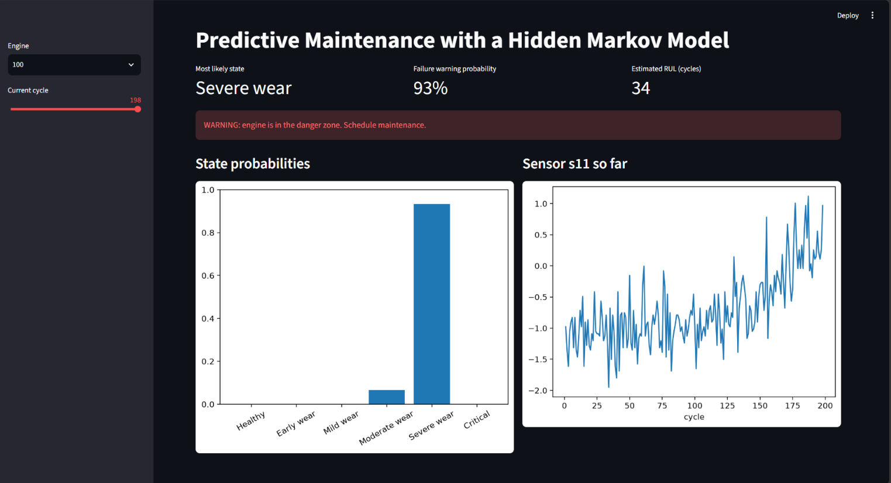
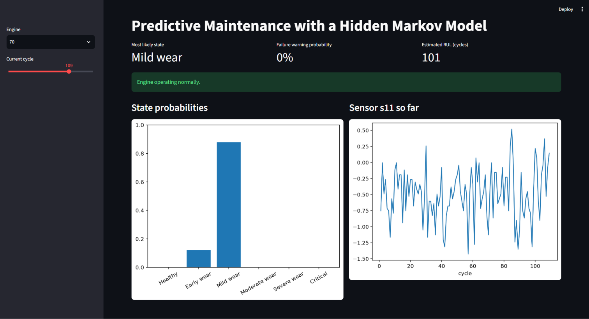

# Predictive Maintenance of Turbofan Engines using Hidden Markov Models

A Hidden Markov Model that infers the hidden health state of an aircraft engine from noisy sensor readings, predicts its Remaining Useful Life (RUL), and raises a failure warning before breakdown.




## Problem
Engines degrade over time, but their true health is not directly observable. Only noisy sensors (temperature, pressure, speed) are available. Unplanned failures are expensive and dangerous, so we want an early, interpretable warning.

## Dataset
NASA C-MAPSS turbofan degradation data, subset FD001 (100 training engines run to failure, 100 test engines cut off before failure).

## Method
1. **Preprocessing:** removed near-constant sensors, kept the 9 sensors most correlated with RUL, standardized them.
2. **Model:** Gaussian HMM with a **left-to-right** structure (an engine can only stay or move to a worse state), trained with the **Baum-Welch (EM)** algorithm.
3. **Model selection:** compared 3 to 6 states using BIC and the ordering of states vs RUL. Chose **6 states** (Healthy to Critical).
4. **Initialization:** states initialized from segments of each engine's life, which fixed local optima and gave correctly ordered states.
5. **Inference:** filtering (live state estimate), smoothing, and **Viterbi (MAP)** decoding. Forward, Backward and Viterbi are **implemented from scratch** in `src/hmm_scratch.py` and verified to match `hmmlearn` exactly.
6. **RUL estimate:** expected RUL = sum over states of P(state) x average RUL of that state (RUL capped at 125 cycles).
7. **Failure warning:** P(warning) = probability of being in the two worst states.

## Results
| Method | RUL RMSE (cycles) |
|---|---|
| HMM (uncapped RUL) | 35.0 |
| HMM (RUL capped at 125) | 23.6 |
| Linear regression baseline | 23.3 |

- Failure warning (threshold 0.5): precision 0.79, recall 0.76, AUC <fill in>.
- On the sample engine, the warning fires roughly 30 to 40 cycles before failure.
- **Honest note:** the HMM is about as accurate as linear regression for RUL. Its advantage is interpretability: it reports a health state with probabilities, which a regression cannot.

## Run it
```bash
pip install -r requirements.txt
streamlit run app.py
```

## Project structure
```
data/        NASA C-MAPSS files
models/      trained model artifacts
notebooks/   main.ipynb (full analysis)
src/         hmm_scratch.py (Forward, Backward, Viterbi)
app.py       Streamlit demo
docs/        screenshots
```

## Limitations and future work
- The model is trained on one operating condition (FD001). FD002 to FD004 have multiple conditions and fault modes.
- State probabilities are overconfident (thresholds 0.5 and 0.7 behave the same).
- BIC tends to favor many states because the rows within an engine are correlated.
- Future work: multiple-condition datasets, hazard-based RUL, calibrating the warning probability, comparison with deep learning models.

## Syllabus mapping
Temporal models and filtering/smoothing, MAP inference
